# FIC: диаграммы работы проекта

Документ описывает текущую архитектуру по коду `fic`, `fic-cli`, `fic-gui` и `fic-dick`.
Диаграммы написаны в Mermaid и должны отображаться в GitHub, GitLab, Obsidian и многих IDE.

## 1. Общая архитектура

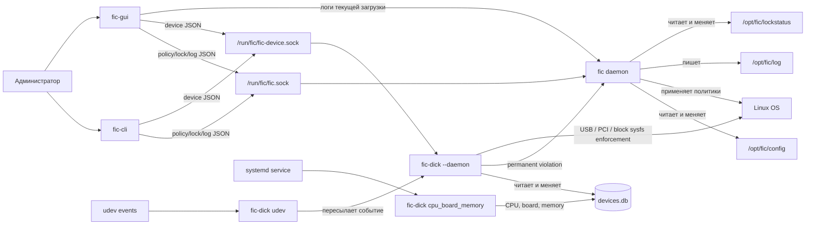

Главная идея проекта: демон `fic` владеет изменением конфигурации политик и применением обычных системных политик к ОС. `fic-dick --daemon` владеет деревом устройств, `devices.db`, udev-событиями и исполнением решений контроля устройств. `fic-cli` и `fic-gui` являются клиентами обоих IPC API: `/run/fic/fic.sock` для общих политик и `/run/fic/fic-device.sock` для дерева устройств.

Категорийные политики DC (`block_usb_storage`,
`block_printers_scanners`, `block_optical_drives`) имеют фиксированное значение
`true`. Их действие определяется только статусом политики:
`ENABLE` включает блокировку категории, `DISABLE` выключает ее.

Общая IPC-логика вынесена в библиотеку `fic-common/fic-ipc`; она содержит клиентский
код Unix socket/JSON-протокола и общие helpers ответа. Клиенты и демон
используют ее как публичную границу IPC вместо прямого include из `fic/src`.

Низкоуровневые общие утилиты вынесены в `fic-common/fic-core`: обработчики
конфигурационных файлов, логирование, локализация, запуск процессов, блокировки
и проверка хэшей команд. Внутренний код использует публичные заголовки
`<fic/core/...>` напрямую.

Работа с SQLite-базой устройств вынесена в библиотеку `fic-common/fic-device-db`.
`fic-dick` использует общий слой доступа к `devices.db`; демон `fic` не обслуживает
дерево устройств и не открывает эту БД в runtime.

Базовая модель политик вынесена в `fic-common/fic-policy`: `Policy`,
`PolicyApplyResult` и типы значений `PolicyTypeValue`. Конкретные политики
модулей остаются в `fic/src/modules`; общий policy API подключается через
`<fic/policy/...>`.

Доступ к daemon API намеренно задается правами Unix-сокета. Члены системной
группы `fic` считаются полными администраторами FIC и на текущем этапе имеют
полный доступ ко всем командам API демона. Это осознанное решение: обычных
пользователей не следует добавлять в группу `fic`.

## 2. Компоненты и зоны ответственности

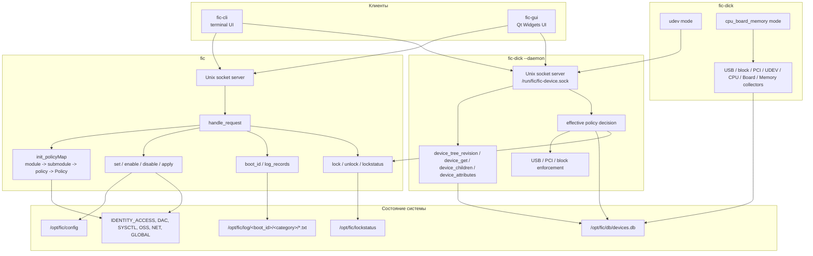

## 3. Жизненный цикл демона `fic`

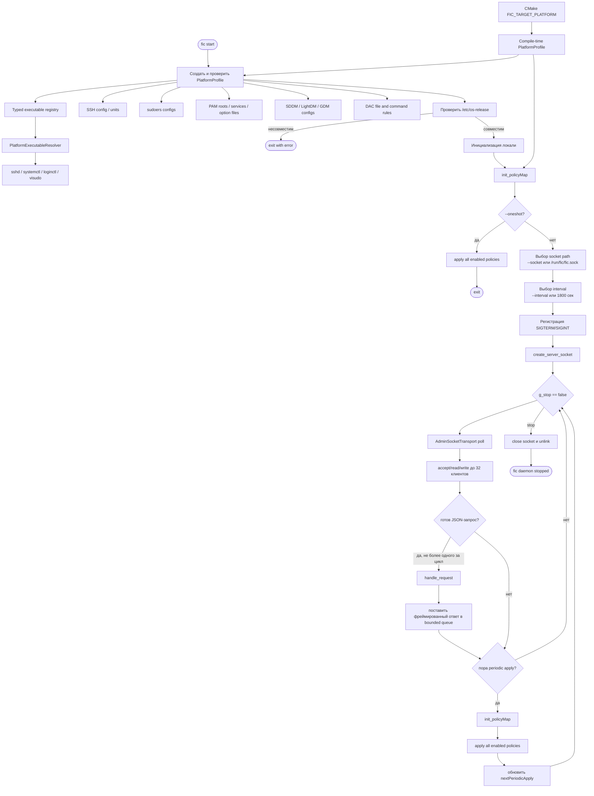

Профиль выбирается только во время сборки. Runtime-проверка не ищет другой
профиль, а fail-closed подтверждает, что пакет запущен на предназначенной для
него ОС. `init_policyMap()` передает один и тот же immutable профиль политикам
при первой и каждой последующей инициализации. Профиль владеет интеграционными
данными systemd/login, SSH, sudo, PAM, display manager и DAC. Кандидаты команд
хранятся в едином типизированном реестре, а политики получают выбранный путь
через общий `PlatformExecutableResolver`; выбор backend конкретной графической
среды и стандартные FHS/kernel-пути остаются capability-зависимыми.

## 4. IPC-запрос от CLI или GUI

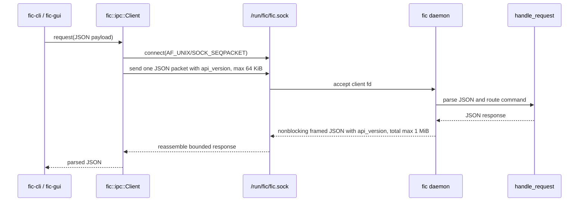

Transport не вызывает обработчик прямо из `accept`: ожидающие первый пакет и
не читающие ответ клиенты остаются в неблокирующем `poll`-контуре. Первый пакет
имеет deadline 2 секунды, запись ответа — 5 секунд, клиентский запрос целиком —
30 секунд по умолчанию. В одном цикле исполняется не более одного запроса,
поэтому мутации остаются последовательными, а periodic apply не блокируется
бездействующим соединением.

Основные команды IPC:

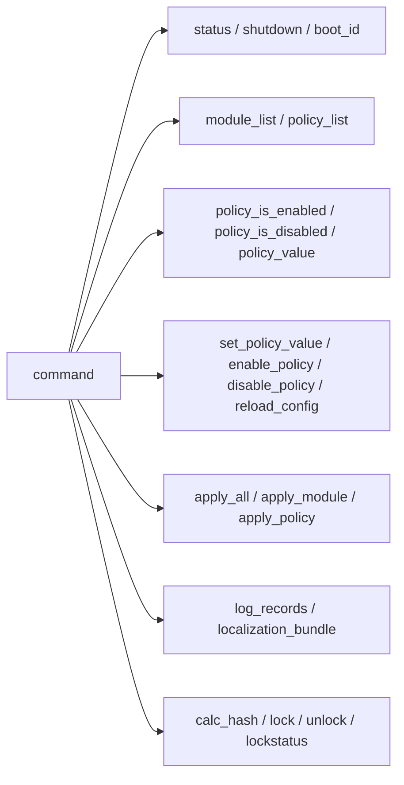

Команды дерева устройств обслуживает `fic-dick --daemon` на `/run/fic/fic-device.sock`:

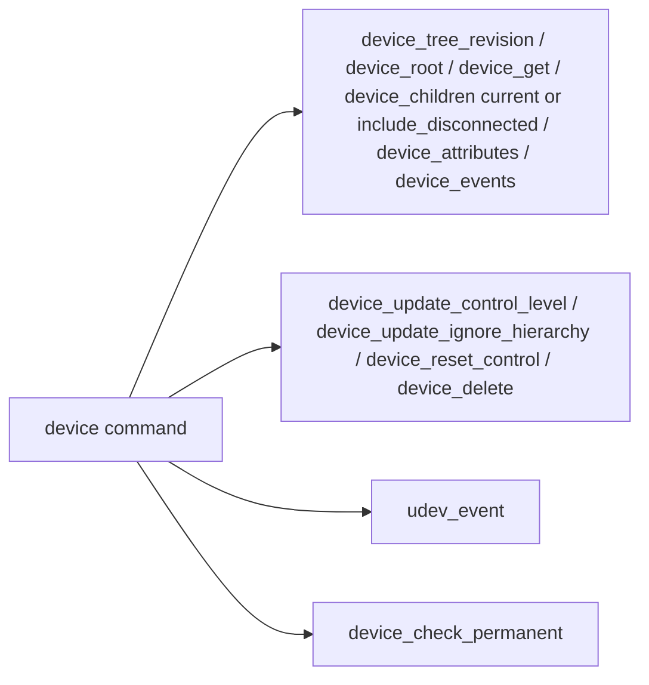

## 5. Изменение и применение политики

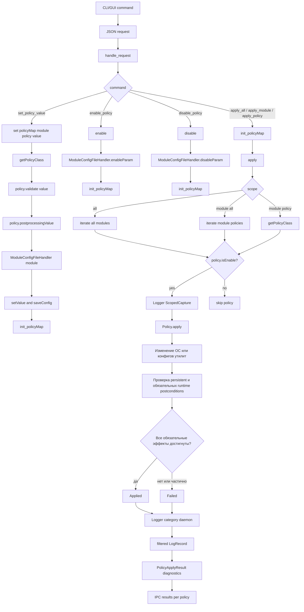

`ScopedCapture` действует только во время одного вызова `Policy::apply()` и
хранится в thread-local контексте `Logger`. Записи добавляются в capture после
проверки `GLOBAL/log_level`, поэтому файловый журнал и diagnostics используют
одинаковую фильтрацию. Результат применения владеет копией структурированных
полей `timestamp`, `level`, `category`, `message`; состояние не сохраняется в
объекте `Policy`. Объем ограничивается на уровне одного capture и всего
IPC-ответа, а усечение обозначается `diagnostics_truncated`.

`Policy::apply()` сохраняет бинарный контракт. `true` означает, что
persistent-состояние проверено и все физически возможные и безопасные без
перезагрузки runtime-эффекты применены и подтверждены. Частичное выполнение
возвращает `false`; подробности остаются в diagnostics. Потенциально опасная
активация, например remount работающей файловой системы после изменения
`/etc/fstab`, не входит в обязательные runtime-действия.

Запись конфигурационных файлов централизована в `fic-core`:

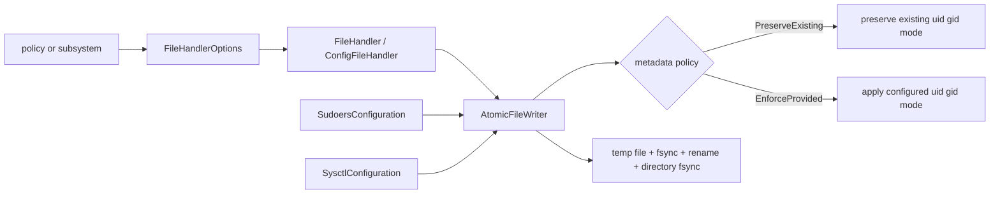

Создание отсутствующего файла по умолчанию запрещено и проверяется самим
`AtomicFileWriter`, в том числе при сохранении после чтения. Оно включается явно
только для управляемых сценариев: `/etc/sysctl.conf`, записи конфигурации display
manager, `/opt/fic/db/commandhash.txt` и managed sudoers-файла. Поэтому чтение
отсутствующего системного конфига больше не имеет побочного эффекта.

`SudoersConfiguration` использует тот же низкоуровневый writer напрямую,
поскольку работает с графом файлов, а не с одним форматом `FileHandler`.
Требуемые метаданные остаются доменным решением вызывающего компонента.

`SysctlConfiguration` также является доменным обработчиком: он воспроизводит
приоритеты procps-ng `sysctl --system`, вычисляет последнюю эффективную запись и
записывает только managed-блок FIC в конце `/etc/sysctl.conf`. Общий
`ConfigFileHandler` для этого не используется, поскольку его однофайловая
модель не выражает подавление одноименных файлов и глобальную сортировку.

Доверенные hashes системных команд обновляются только в границе пакетной
транзакции:

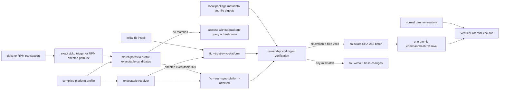

Для политик `Sudo` системная конфигурация рассматривается как единый include-
граф, а не как один `/etc/sudoers`:

```mermaid
flowchart LR
    sudoPolicy[Sudo policy] --> graph[SudoersConfiguration]
    graph --> mainFile[/etc/sudoers]
    graph --> includes[include files and directories]
    graph --> effective[effective Defaults and source locations]
    effective --> preflight[whole-graph preflight]
    preflight --> strategy{remediation strategy}
    strategy -->|scalar Defaults| managed[/etc/sudoers.d/zzzz-fic]
    strategy -->|authentication bypass| origin[atomic source token replacement]
    managed --> visudo[verified visudo validation]
    origin --> visudo
    visudo --> reload[reload graph and verify postcondition]
    visudo -->|failure| rollback[rollback all written sources]
```

Клиенты не передают пути sudoers-файлов через IPC. Пути появляются только из
фиксированного `/etc/sudoers` и доверенного include-графа. Для `Defaults`
изменяется только managed-файл; политика `sudo_require_authentication` изменяет
в источнике только `NOPASSWD`, `authenticate` и `exempt_group`, не расширяя
список разрешенных команд.

Для политик `SYSCTL` поток выглядит так:

```mermaid
flowchart LR
    policy[SYSCTL policy] --> runtimePreflight[read and validate /proc/sys key]
    runtimePreflight --> loader[SysctlConfiguration]
    loader --> roots[fixed sysctl.d roots]
    roots --> select[same-name priority]
    select --> order[global lexical order]
    order --> main[/etc/sysctl.conf last]
    main --> effective[effective exact key including globs and exclusions]
    effective -->|matches| unchanged[no write]
    effective -->|deviation| block[managed block at EOF]
    block --> writer[AtomicFileWriter root:root 0644]
    writer --> reload[reload and verify postcondition]
    reload -->|failure| rollback[restore original main file]
    reload -->|success| runtimeEnsure[direct /proc/sys write when needed]
    runtimeEnsure --> runtimeVerify[read and verify runtime value]
    runtimeVerify -->|failure| failed[policy failed with partial diagnostics]
```

Сторонние sysctl-файлы используются для вычисления результата и диагностики,
но не переписываются. Runtime-ключ строится только из внутреннего имени
политики, проверяется и открывается без следования по symlink. Отсутствующий
ключ и любое неподтвержденное runtime-изменение делают применение неуспешным,
даже если persistent managed-блок уже записан.

SSH-политики аналогично перечитывают записанный файл, получают все эффективные
значения через проверяемый `sshd -T`, а затем отдельно аудируют полный граф
`Include` и условные `Match`-переопределения. Скалярный параметр должен иметь
единственное ожидаемое значение; `Port` дополнительно проверяет полный набор
портов и порты effective-`ListenAddress`. Неоднозначный include-граф и
ослабляющее условное значение обрабатываются fail-closed. Общий
`SshConfigSyntax` используется и редактором основного файла, и отдельным
`SshConfigAudit`; дочерний include наследует копию текущего `Match`, не изменяя
контекст содержащего файла. После проверки выполняется reload активного
`ssh.service`/`sshd.service` через проверяемый `systemctl`. Неуспешный reload
считается частичным применением и возвращает ошибку. Для `/etc/fstab`
выполняется повторный разбор записанного файла, но runtime remount намеренно
исключен как потенциально опасное действие.

PAM-политики разделяют намерение политики, provider и конкретный файл
параметров:

```mermaid
flowchart TD
    authPolicy[IDENTITY_ACCESS / PAM policy] --> profile[PAM platform profile]
    profile --> services[target services and search roots]
    services --> graph[PamConfiguration effective include graph]
    graph --> providers[PamProviderInspector capability providers]
    providers --> conflict{exactly one supported provider per service?}
    conflict -->|no| reject[fail closed without write]
    conflict -->|yes| topology[topology and config/module file checks]
    topology --> overrides[conf path and argument override checks]
    overrides --> optionFile[canonical option file]
    optionFile --> writer[AtomicFileWriter root:root 0644]
    writer --> reload[reparse file and PAM graphs]
    reload --> postcondition[provider / module / value postcondition]
```

Граф учитывает `@include`, `include` и `substack`; циклы, превышение лимитов и
неподдерживаемый синтаксис отклоняются. Capability lockout распознает
`pam_faillock`, `pam_tally2` и `pam_tally`, quality — `pam_pwquality`,
`pam_passwdqc` и `pam_cracklib`, history — `pam_pwhistory` и
`pam_unix remember=`. Первая версия применяет политики только к
`pam_faillock`, `pam_pwquality` и `pam_pwhistory`; конфликтующие или
альтернативные providers диагностируются, но не мигрируются. PAM service-файлы
не переписываются: меняется канонический provider-конфиг только после
доказательства, что он уже effective во всех существующих целевых службах.

Классы identity-модуля разделяют policy metadata и владение системной
конфигурацией:

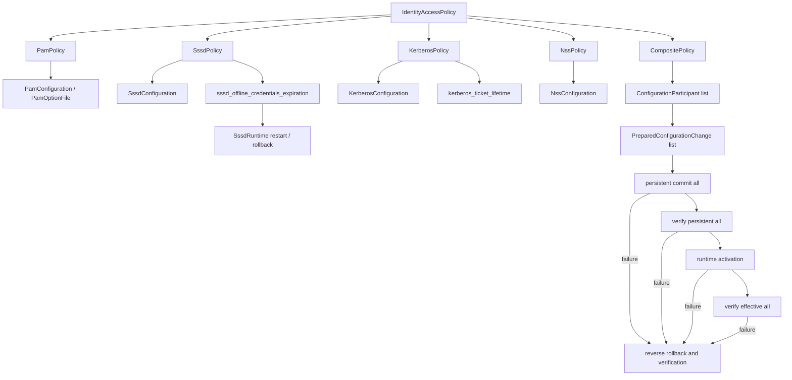

Вложенные `Policy` в composite не используются: только внешний объект в
`PolicyMap` владеет `moduleConf`, `policyName` и значением. Composite владеет
подсистемными `ConfigurationParticipant`, и все они готовят изменения до
первой записи. Координатор является компенсирующей транзакцией, но не заявляет
crash-atomicity нескольких файлов без transaction journal.

## 6. Карта модулей и политик

```mermaid
flowchart TB
    init[init_policyMap] --> arr["vector&lt;unique_ptr&lt;Policy&gt;&gt;"]

    arr --> dac[DAC]
    dac --> dacMode[ModeAndOwner]
    dacMode --> dacSystemCommandLock[systemcommandlock]
    dacMode --> dacBlockSystemFiles[blocking_user_access_to_system_files]
    dacMode --> dacCustomMode[custom_mode_and_owner]
    dac --> sudo[Sudo]
    sudo --> sudoEnvReset[sudo_env_reset]
    sudo --> sudoPassTries[sudo_passwd_tries]
    sudo --> sudoSecurePath[sudo_securepath]
    sudo --> sudoTimeout[sudo_timeout]
    sudo --> sudoRequireAuthentication[sudo_require_authentication]

    arr --> sysctl[SYSCTL]
    sysctl --> fsKernel[FSKernelProtection]
    sysctl --> globalKernel[GlobalKernelProtection]
    sysctl --> networkKernel[NetworkKernelProtection]

    arr --> oss[OSS]
    oss --> display[DisplayManager]
    oss --> desktop[DesktopEnvironment]
    oss --> fstab[Fstab]

    arr --> net[NET]
    net --> ssh[Ssh]
    ssh --> sshPort[ssh_port]
    ssh --> sshMaxAuthTries[ssh_max_auth_tries]
    ssh --> sshRootLogin[ssh_root_login]
    ssh --> sshPubkeyAuth[ssh_pubkey_auth]

    arr --> identity[IDENTITY_ACCESS]
    identity --> pam[PAM]
    identity --> sssd[SSSD editor base]
    identity --> kerberos[KERBEROS editor base]
    identity --> nss[NSS editor base]
    identity -. abstract .-> composite[COMPOSITE]
    pam --> passwordMinLength[password_min_length]
    pam --> passwordMinClasses[password_min_classes]
    pam --> passwordHistoryDepth[password_history_depth]
    pam --> passwordHistoryRoot[password_history_enforce_for_root]
    pam --> failedAttempts[failed_authentication_attempts]
    pam --> countingPeriod[failed_authentication_counting_period]
    pam --> failedRoot[failed_authentication_enforce_for_root]
    pam --> unlockTime[failed_authentication_unlock_time]
    sssd --> offlineExpiration[sssd_offline_credentials_expiration]
    kerberos --> ticketLifetimePolicy[kerberos_ticket_lifetime]

    arr --> global[GLOBAL]
    global --> systemSettings[SystemSettings]

    dacSystemCommandLock --> map["policyMap<br/>module -> submodule -> policy -> object"]
    dacBlockSystemFiles --> map
    dacCustomMode --> map
    sudoEnvReset --> map
    sudoPassTries --> map
    sudoSecurePath --> map
    sudoTimeout --> map
    sudoRequireAuthentication --> map
    fsKernel --> map
    globalKernel --> map
    networkKernel --> map
    display --> map
    desktop --> map
    fstab --> fstabTmp[fstab_tmp_profile]
    fstab --> fstabVarTmp[fstab_var_tmp_profile]
    fstab --> fstabDevShm[fstab_dev_shm_profile]
    fstab --> fstabHome[fstab_home_profile]
    fstab --> fstabMedia[fstab_removable_media_profile]
    fstab --> fstabVarLog[fstab_var_log_secure_options]
    fstab --> fstabAudit[fstab_var_log_audit_secure_options]
    fstab --> fstabBoot[fstab_boot_profile]
    fstab --> fstabBootEfi[fstab_boot_efi_profile]
    fstab --> fstabSrv[fstab_srv_profile]
    fstab --> fstabOpt[fstab_opt_profile]
    fstabTmp --> map
    fstabVarTmp --> map
    fstabDevShm --> map
    fstabHome --> map
    fstabMedia --> map
    fstabVarLog --> map
    fstabAudit --> map
    fstabBoot --> map
    fstabBootEfi --> map
    fstabSrv --> map
    fstabOpt --> map
    sshPort --> map
    sshMaxAuthTries --> map
    sshRootLogin --> map
    sshPubkeyAuth --> map
    passwordMinLength --> map
    passwordMinClasses --> map
    passwordHistoryDepth --> map
    failedAttempts --> map
    unlockTime --> map
    systemSettings --> map
```

## 7. Работа GUI

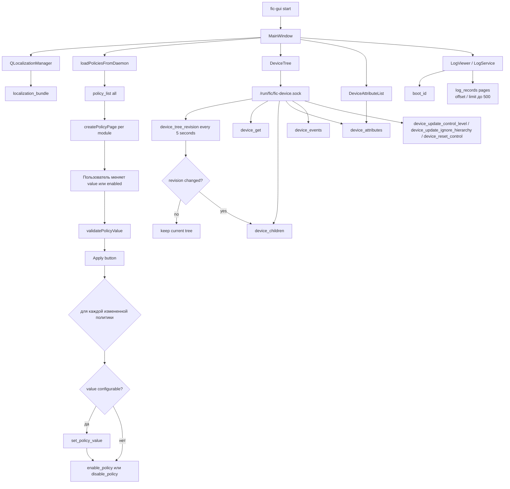

GUI не применяет политики к ОС напрямую. Он показывает данные, валидирует ввод на стороне интерфейса и затем отправляет изменения демону отдельными IPC-командами.
Логи загружаются страницами не более 500 записей и 768 КиБ; GUI следует по
`next_offset`, пока `has_more` остается истинным.

## 8. Сбор и отображение устройств

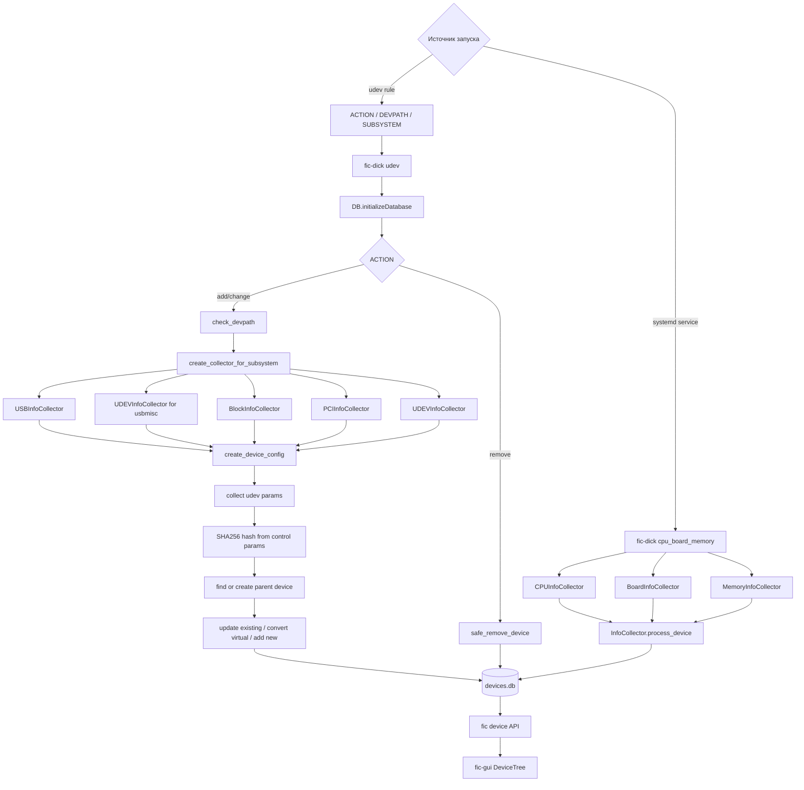

## 9. Хранилища данных

Production-значения путей задаются один раз в
`cmake/FicInstallLayout.cmake`. На этапе конфигурации CMake из них создаются
типизированные C++ defaults для `fic-core`/`fic-ipc`, а также systemd,
tmpfiles, udev и XDG-шаблоны. Исполняемые компоненты инициализируют неизменяемый
контекст путей при старте; общий слой базы устройств получает `DBOptions`
явно и поэтому не знает о layout продукта.

Это не единый `FIC_ROOT`: config, state, logs, static data и runtime socket
остаются независимыми семантическими путями. Такой контракт позволяет менять
профиль установки через CMake без строковых замен в C++ или service-файлах.
Deb/RPM staging устанавливает именованные CMake-компоненты (`fic`, `fic-dick`,
`fic-cli`, `fic-session-agent`, `fic-gui`) и не копирует эти файлы повторно из
дерева исходников.

Product upgrade использует отдельный persistent state path и не выполняет
неявный repair при обычном старте. Версии IPC, конфигураций и SQLite независимы;
точные значения генерируются `fic-common/fic-version`. Package lifecycle
останавливает сервисы, последовательно продвигает атомарный журнал, сохраняет
конфиги и WAL-consistent SQLite backup, выполняет offline migration и только
после проверок запускает сервисы. Полный контракт и downgrade/remove policy
описаны в `docs/upgrade-contract.md`.


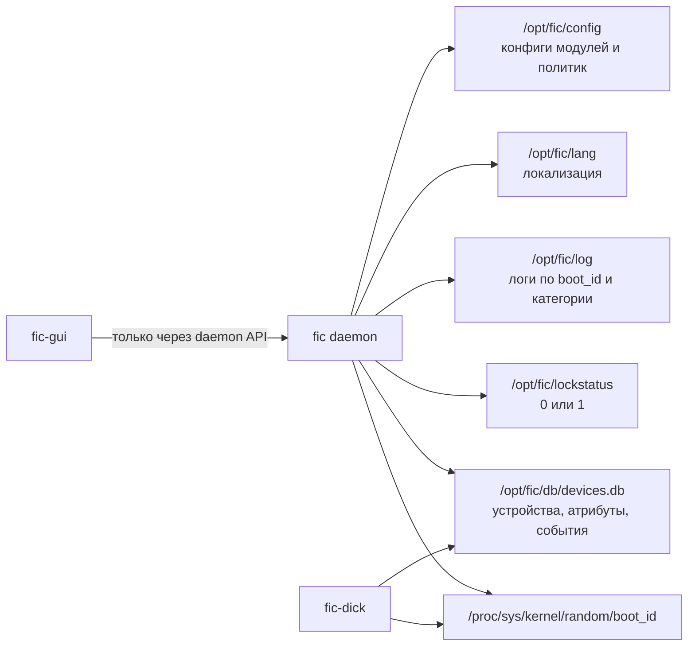

Production IPC использует профиль `ProductionAdmin`: реальный (не symlink)
runtime-каталог `root:fic 0770` и сокет `0660`. Явный `--socket` включает
профиль разработки с сокетом `0600`; этот режим не ослабляет production path.
Установленное дерево `/opt/fic` отделено от этой модели: оно принадлежит
`root:fic`, но группа имеет только read/traverse/execute (`2750` для каталогов,
`0640` для обычных файлов и `0750` для `/opt/fic/bin`). Член группы может
читать конфигурацию и БД для диагностики, но клиентские изменения по-прежнему
выполняются только через daemon API.
