# FIC: диаграммы работы проекта

Документ описывает текущую архитектуру по коду `fic`, `fic-cli`, `fic-gui` и `fic-dick`.
Диаграммы написаны в Mermaid и должны отображаться в GitHub, GitLab, Obsidian и многих IDE.

## 1. Общая архитектура

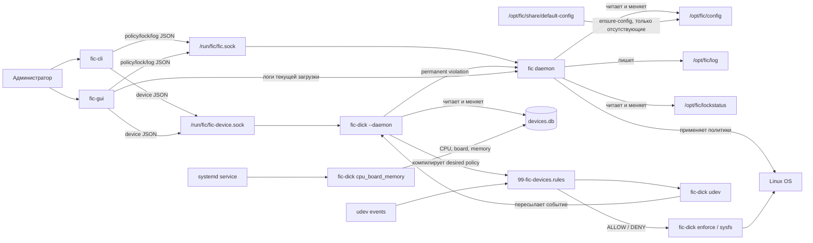

Главная идея проекта: демон `fic` владеет изменением общей конфигурации политик и применением обычных системных политик к ОС. `fic-dick --daemon` владеет деревом устройств, desired policy в `devices.db`, компиляцией active udev rules, initial reconciliation и runtime udev-ingestion. Hotplug ALLOW/DENY определяется generated rules до обращения к daemon/SQLite. `fic-cli` и `fic-gui` являются клиентами административных IPC API: `/run/fic/fic.sock` для общих политик и `/run/fic/fic-device.sock` для дерева устройств. Runtime udev-события после enforcement поступают в отдельный локальный endpoint `/run/fic/fic-device-events.sock`.

Категорийные политики DC (`block_usb_storage`,
`block_printers_scanners`, `block_optical_drives`) имеют фиксированное значение
`true`. Их действие определяется только статусом политики:
`ENABLE` включает блокировку категории, `DISABLE` выключает ее.
Ручные изменения правил устройства через device API меняют желаемое состояние
дерева. Если правило делает уже подключенное устройство эффективным `blocked`,
`fic-dick` не деактивирует его немедленно и возвращает предупреждение
`deferred_block`; фактическое отключение выполняется при последующем
подключении или переподключении через обработчик udev `add/change`.

Общая IPC-логика вынесена в библиотеку `fic-common/fic-ipc`; она содержит клиентский
код Unix socket/JSON-протокола и общие helpers ответа. Клиенты и демон
используют ее как публичную границу IPC вместо прямого include из `fic/src`.

Низкоуровневые общие утилиты вынесены в `fic-common/fic-core`: обработчики
конфигурационных файлов, логирование, локализация, запуск процессов, блокировки
и проверка хэшей команд. Внутренний код использует публичные заголовки
`<fic/core/...>` напрямую.

Работа с SQLite-базой устройств вынесена в библиотеку `fic-common/fic-device-db`.
`fic-dick` использует общий слой доступа к `devices.db`; демон `fic` не обслуживает
дерево устройств и не открывает эту БД в runtime.

Базовая модель политик вынесена в `fic-common/fic-policy`: `Policy`,
`PolicyApplyResult` и типы значений `PolicyTypeValue`. Конкретные политики
модулей остаются в `fic/src/modules`; общий policy API подключается через
`<fic/policy/...>`.

Доступ к daemon API намеренно задается правами Unix-сокета. Члены системной
группы `fic` считаются полными администраторами FIC и на текущем этапе имеют
полный доступ ко всем командам API демона. Это осознанное решение: обычных
пользователей не следует добавлять в группу `fic`.

## 2. Компоненты и зоны ответственности

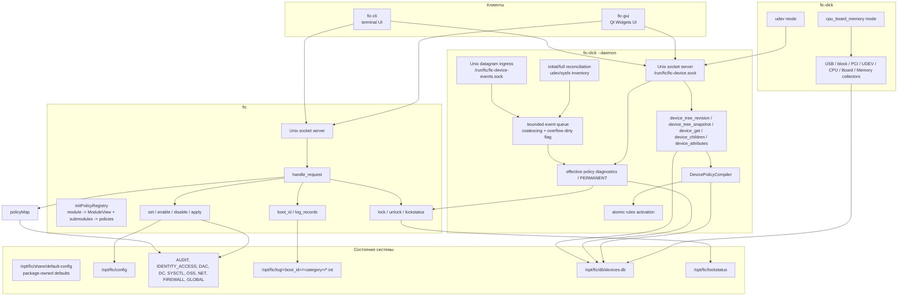

### Структура исходного кода

Верхнеуровневые каталоги соответствуют процессам и reusable libraries:
`fic`, `fic-cli`, `fic-gui`, `fic-dick`, `fic-session-agent` и
`fic-common`. Внутри них действует предметная, а не технически-плоская
группировка:

- `fic-common/fic-core` остаётся одной библиотекой, но разделён на
  `config`, `fs`, `process`, `runtime`, `integrity`, `logging`, `i18n` и
  `notification`;
- daemon разделяет lifecycle (`daemon`), execution/registry (`policy`),
  platform/session/trust и feature-first `modules`; искусственный каталог
  `submodules` в source layout не используется;
- runtime-installed файлы daemon находятся в `fic/src/resources`;
- GUI организован как `app`, `shared` и feature-first области `policies`,
  `devices`, `logs`;
- device-control daemon разделён на `daemon`, `device`, `policy`,
  `enforcement` и `collectors`;
- `tests` зеркалирует production domains, а runtime и packaging сценарии
  находятся в `tests/integration`.

## 3. Жизненный цикл демона `fic`

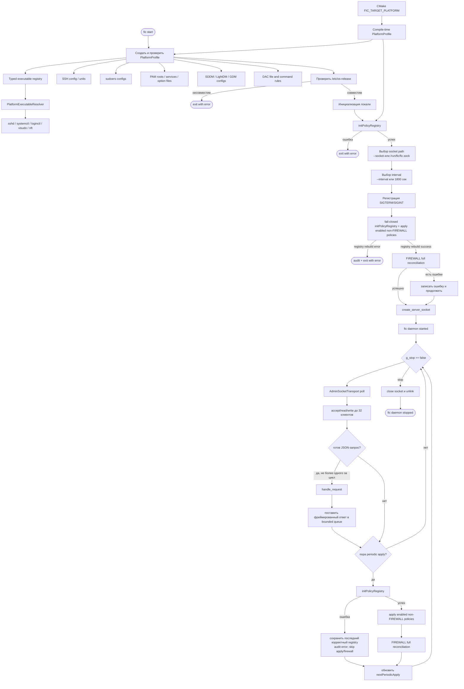

Профиль выбирается только во время сборки. Runtime-проверка не ищет другой
профиль, а fail-closed подтверждает, что пакет запущен на предназначенной для
него ОС. `initPolicyRegistry()` передает один и тот же immutable профиль политикам
при первой и каждой последующей инициализации. Registry строится во временном
объекте и заменяет текущее состояние только после полного успеха. Ошибка
первичной инициализации останавливает daemon до создания socket; ошибка runtime
reload сохраняет последний корректный registry и запрещает связанный apply и
FIREWALL reconciliation. Профиль владеет интеграционными
данными systemd/login, SSH, sudo, PAM, display manager и DAC. Кандидаты команд
хранятся в едином типизированном реестре, а политики получают выбранный путь
через общий `PlatformExecutableResolver`; выбор backend конкретной графической
среды и стандартные FHS/kernel-пути остаются capability-зависимыми.

## 4. IPC-запрос от CLI или GUI

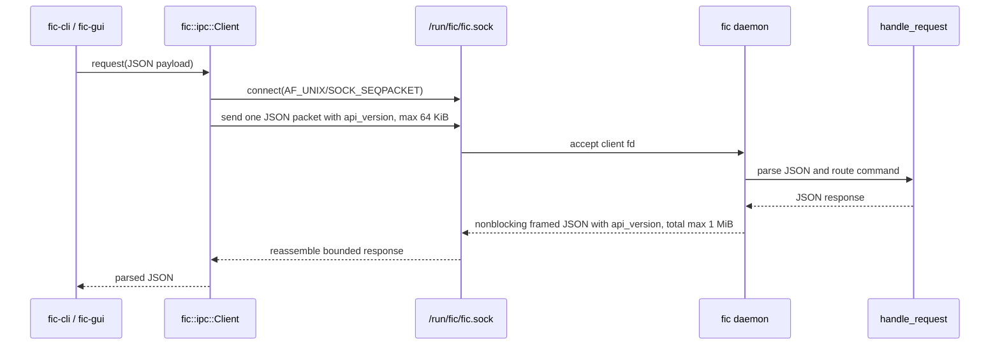

Transport не вызывает обработчик прямо из `accept`: ожидающие первый пакет и
не читающие ответ клиенты остаются в неблокирующем `poll`-контуре. Первый пакет
имеет deadline 2 секунды, запись ответа — 5 секунд, клиентский запрос целиком —
30 секунд по умолчанию. В одном цикле исполняется не более одного запроса,
поэтому мутации остаются последовательными, а periodic apply не блокируется
бездействующим соединением.

Основные команды IPC:

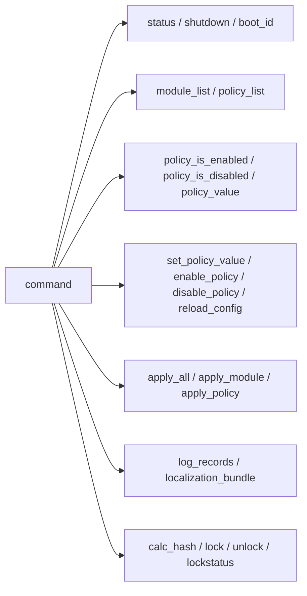

Команды дерева устройств обслуживает `fic-dick --daemon` на `/run/fic/fic-device.sock`.
Этот socket является административным request/response API для GUI/CLI и не
используется как hotplug event queue:

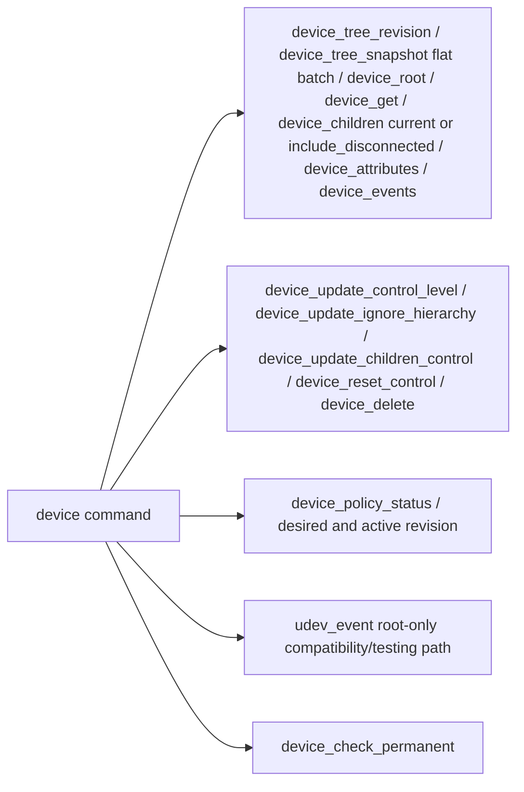

Runtime udev-события идут отдельно:

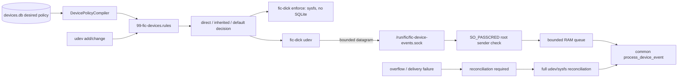

Initial inventory больше не строится через `udevadm trigger --action=add`.
При старте `fic-dick --daemon` выполняет full reconciliation текущего
udev/sysfs состояния, затем проверяет `permanent` устройства. Udev event stream
рассматривается как notification mechanism: событие сообщает, что состояние
могло измениться, а authoritative состояние берется из фактического udev/sysfs
inventory.

`device_tree_snapshot` — read-only batch-контракт для операций GUI, которым
нужно всё дерево. `fic-device-db` в одной read transaction получает revision,
рекурсивное дерево вместе с attributes, все occurrences для identity rules и
DC category state. `fic-dick` вычисляет effective policy по индексам в памяти и
возвращает flat список с `parent_id`, attributes, effective fields, `revision`
и `boot_id`. Повреждённая циклическая/слишком глубокая иерархия и превышение
лимита IPC response завершают запрос ошибкой. Существующие точечные команды и
`device_events` не изменены.

`device_update_control_level`, `device_update_ignore_hierarchy`,
`device_update_children_control` и `device_reset_control` являются изменениями
желаемого состояния. После commit они синхронно компилируют candidate,
атомарно публикуют rules и выполняют udev reload. Они могут
сделать уже подключенное устройство эффективным `blocked`, но не выполняют
немедленную sysfs-деактивацию. В таком случае ответ содержит
`deferred_block=true`, `deferred_blockers[]` и текстовое `warning`.

## 5. Изменение и применение политики

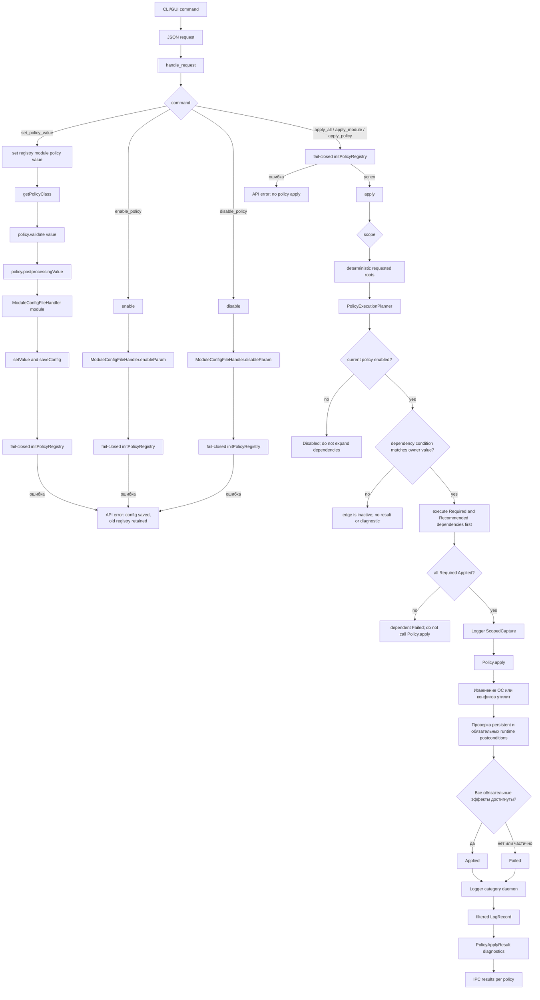

`ScopedCapture` действует только во время одного вызова `Policy::apply()` и
хранится в thread-local контексте `Logger`. Записи добавляются в capture после
проверки `AUDIT/log_level`, поэтому файловый журнал и diagnostics используют
одинаковую фильтрацию. Результат применения владеет копией структурированных
полей `timestamp`, `level`, `category`, `message`; состояние не сохраняется в
объекте `Policy`. Объем ограничивается на уровне одного capture и всего
IPC-ответа, а усечение обозначается `diagnostics_truncated`.

Параллельно daemon ведет security audit trail административных IPC-запросов
через `write_audit_log()`. Этот путь намеренно не использует `Logger` и всегда
включен независимо от `AUDIT/log_level`, в том числе при `NoLog`. Отдельное
исключение `boot_id` и `log_records` предотвращает самогенерацию записей во
время polling и не меняет семантику `log_level`.

`Policy::apply()` сохраняет бинарный контракт. `true` означает, что
persistent-состояние проверено и все физически возможные и безопасные без
перезагрузки runtime-эффекты применены и подтверждены. Частичное выполнение
возвращает `false`; подробности остаются в diagnostics. Потенциально опасная
активация, например remount работающей файловой системы после изменения
`/etc/fstab`, не входит в обязательные runtime-действия.

FIREWALL дополняет, но не меняет этот lifecycle. Одиночный apply включённой
firewall Policy заменяет только её собственную nftables table. После общего
startup/periodic apply pass отдельный reconciler читает статусы всех четырёх
FIREWALL Policy, удаляет stale FIC-owned tables и восстанавливает полный
desired state. Поэтому disabled Policy, которую общий `executePolicy()` не
вызывает, всё равно удаляется из фактического FIREWALL state. Отдельного
состояния включения модуля нет: все disabled означают пустой managed state, а
не остановку reconciliation.

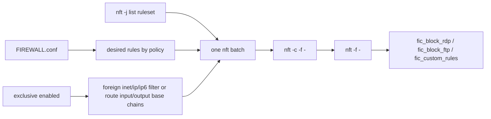

FIC-owned base chains имеют `policy accept`; разрешающее правило завершает
только текущую base chain, а drop остаётся терминальным для ruleset. Exclusive
mode не удаляет чужие таблицы: только влияющая base chain очищается и
пересоздаётся с прежними family/table/name/type/hook/priority и `policy accept`.
NAT, FORWARD, bridge, netdev и остальные цепочки той же таблицы не входят в
scope. Удалённые сторонние правила не восстанавливаются после отключения
exclusive policy.

Запись конфигурационных файлов централизована в `fic-core`:

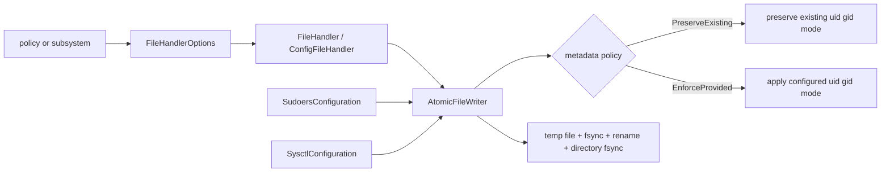

Создание отсутствующего файла по умолчанию запрещено и проверяется самим
`AtomicFileWriter`, в том числе при сохранении после чтения. Оно включается явно
только для управляемых сценариев: `/etc/sysctl.d/zzzz-fic.conf`, записи
конфигурации display manager, `/opt/fic/db/commandhash.txt` и managed
sudoers-файла. Поэтому чтение
отсутствующего системного конфига больше не имеет побочного эффекта.

`SudoersConfiguration` использует тот же низкоуровневый writer напрямую,
поскольку работает с графом файлов, а не с одним форматом `FileHandler`.
Требуемые метаданные остаются доменным решением вызывающего компонента.

`SysctlConfiguration` также является доменным обработчиком. Он различает
runtime-состояние `/proc/sys`, boot-effective persistent-конфигурацию выбранного
platform loader и представление ручного `procps sysctl --system`. Для
поддерживаемых systemd-профилей boot-effective значение считается по
`systemd-sysctl`/`sysctl.d/*.conf`: приоритет каталогов для одинаковых имен,
глобальная лексикографическая сортировка, glob/exclusion-правила и source
location. FIC владеет только `/etc/sysctl.d/zzzz-fic.conf`; `/etc/sysctl.conf`
и чужие `sysctl.d` файлы используются для диагностики, но не переписываются.
Общий `ConfigFileHandler` для этого не используется, поскольку его однофайловая
модель не выражает подавление одноименных файлов, глобальную сортировку и
отдельный FIC-owned managed file.

Доверенные hashes системных команд обновляются только в границе пакетной
транзакции:

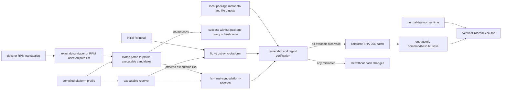

Для политик `Sudo` системная конфигурация рассматривается как единый include-
граф, а не как один `/etc/sudoers`:

```mermaid
flowchart LR
    sudoPolicy[Sudo policy] --> graph[SudoersConfiguration]
    graph --> mainFile[/etc/sudoers]
    graph --> includes[include files and directories]
    graph --> effective[effective Defaults and source locations]
    effective --> preflight[whole-graph preflight]
    preflight --> strategy{remediation strategy}
    strategy -->|scalar Defaults| managed[/etc/sudoers.d/zzzz-fic]
    strategy -->|authentication bypass| origin[atomic source token replacement]
    managed --> visudo[verified visudo validation]
    origin --> visudo
    visudo --> reload[reload graph and verify postcondition]
    visudo -->|failure| rollback[rollback all written sources]
```

Клиенты не передают пути sudoers-файлов через IPC. Пути появляются только из
фиксированного `/etc/sudoers` и доверенного include-графа. Для `Defaults`
изменяется только managed-файл; политика `sudo_require_authentication` изменяет
в источнике только `NOPASSWD`, `authenticate` и `exempt_group`, не расширяя
список разрешенных команд.

Для политик `SYSCTL` поток выглядит так:

```mermaid
flowchart LR
    policy[SYSCTL policy] --> runtimePreflight[read and validate /proc/sys key]
    runtimePreflight --> loader[SysctlConfiguration]
    loader --> platform[PlatformProfile sysctl loader]
    platform --> roots[systemd sysctl.d roots]
    roots --> select[same-name priority]
    select --> order[global lexical order]
    order --> effective[boot-effective exact key including globs and exclusions]
    effective -->|matches| unchanged[no write]
    effective -->|deviation| managed[/etc/sysctl.d/zzzz-fic.conf]
    managed --> writer[AtomicFileWriter root:root 0644]
    writer --> reload[reload and verify postcondition]
    reload -->|overridden| conflict[conflict with overriding source path:line]
    conflict --> rollback[restore original managed file]
    reload -->|failure| rollback
    reload -->|success| runtimeEnsure[direct /proc/sys write when needed]
    runtimeEnsure --> runtimeVerify[read and verify runtime value]
    runtimeVerify -->|failure| failed[policy failed with partial diagnostics]
```

Сторонние sysctl-файлы используются для вычисления результата и диагностики,
но не переписываются. Если после записи managed-файла другой boot-effective
source перекрывает значение, policy apply завершается ошибкой с указанием
ожидаемого значения, фактического значения и перекрывающего `path:line`, а
managed-файл откатывается. Runtime-ключ строится только из внутреннего имени
политики, проверяется и открывается без следования по symlink. Отсутствующий
ключ и любое неподтвержденное runtime-изменение делают применение неуспешным,
даже если persistent managed-файл уже подготовлен.

SSH-политики аналогично перечитывают записанный файл, получают все эффективные
значения через проверяемый `sshd -T`, а затем отдельно аудируют полный граф
`Include` и условные `Match`-переопределения. Скалярный параметр должен иметь
единственное ожидаемое значение; `Port` дополнительно проверяет полный набор
портов и порты effective-`ListenAddress`. Неоднозначный include-граф и
ослабляющее условное значение обрабатываются fail-closed. Общий
`SshConfigSyntax` используется и редактором основного файла, и отдельным
`SshConfigAudit`; дочерний include наследует копию текущего `Match`, не изменяя
контекст содержащего файла. После проверки выполняется reload активного
`ssh.service`/`sshd.service` через проверяемый `systemctl`. Неуспешный reload
считается частичным применением и возвращает ошибку. Для `/etc/fstab`
выполняется повторный разбор записанного файла, но runtime remount намеренно
исключен как потенциально опасное действие.

PAM-политики разделяют намерение политики, provider и конкретный файл
параметров:

```mermaid
flowchart TD
    authPolicy[logical PAM policy] --> capability[security capability]
    capability --> provider[provider descriptor / backend]
    provider --> grammar[typed codec and config grammar]
    grammar --> topology[topology strategy]
    topology --> profile[platform composition]
    profile --> services[capability-specific scope and search roots]
    services --> graph[PamConfiguration effective include graph]
    graph --> providers[PamProviderInspector provider verification]
    providers --> conflict{exactly one supported provider per service?}
    conflict -->|no| reject[fail closed without write]
    conflict -->|yes| checks[topology and config/module file checks]
    checks --> flow[PamControlFlowAnalyzer successful-path proof]
    flow --> verifier[PamCapabilityVerifier enforcement state]
    verifier --> overrides[provider-specific config path and inline overrides]
    overrides --> optionFile[PamOptionFile or strict PasswdqcConfigFile]
    optionFile --> writer[AtomicFileWriter root:root 0644]
    writer --> reload[reparse file and PAM graphs]
    reload --> postcondition[provider / module / value postcondition]
```

Граф учитывает `@include`, `include` и `substack`; границы `substack`
сохраняются для Linux-PAM semantics numeric jumps, `done`, `die` и `reset`.
`PamControlFlowAnalyzer` символически проверяет, что успешный путь не обходит
обязательный provider; неизвестный модуль считается недетерминированным и не
может служить доказательством безопасности. Циклы, превышение лимитов и
неподдерживаемый control syntax отклоняются fail-closed. Capability lockout распознает
`pam_faillock`, `pam_tally2` и `pam_tally`, quality — `pam_pwquality`,
`pam_passwdqc` и `pam_cracklib`, history — `pam_pwhistory` и
`pam_unix remember=`. Capability-aware registry публикует только точные
mappings выбранного provider. `pam_pwquality` получает minlen/minclass,
user/GECOS checks, difok и class credits; `pam_passwdqc` получает native
five-field `min`, passphrase, match, similar и retry. Общий
`password_quality_enforce_for_root` кодируется provider backend'ом как
pwquality flag либо passwdqc `enforce=everyone|users`. Конфликтующие или
неподдерживаемые alternative providers диагностируются, но не мигрируются.
Daemon PAM
policies не переписывают PAM service-файлы: меняется канонический
provider-конфиг только после доказательства, что topology уже effective во
всех существующих целевых службах. Отдельный offline package-integration
manager для ALT p11 может атомарно включать и отключать FIC-owned topology по
явной команде администратора; он не вызывается daemon policies.
`required_pam_enforcement` независимо проверяет выбранные известные providers
как системный invariant; он не объявляет dependencies другим policies, не
устанавливает пакеты и не исправляет чужой PAM stack.

`PamTopologyManager` отделяет `inspect/canEnable/enable/disable` от provider
configuration. Текущая mutable strategy — ALT/tcb manager для `pam_faillock`;
Debian/Ubuntu описывают `pam-auth-update` как external opt-in, а native
passwdqc topology ALT — как static/read-only. Config policies не активируют
topology неявно. Password-history config и topology также являются разными
состояниями: Debian/Ubuntu изменяют `pwhistory.conf` только после доказательства
active effective stack, ALT эту capability не объявляет.

Политики `IDENTITY_ACCESS/PASSWORD_AGING` управляют плоским
`/etc/login.defs` через общий для identity configuration
`LoginDefsFileHandler`.
Неизвестные строки, комментарии и пустые строки сохраняются; duplicate или
malformed occurrence целевого ключа отклоняется до записи. Пять config-policy
задают `PASS_MIN_DAYS`, `PASS_MAX_DAYS`, `PASS_WARN_AGE`, `UID_MIN` и
`UID_MAX`. Две operational policy объявляют Required dependencies через общий
policy dependency graph и после их применения повторно читают фактический
`login.defs`. Начальный `IDENTITY_ACCESS.conf` генерируется при сборке из
defaults выбранного platform profile, а не из состояния build host. Одни и те
же CMake platform constants генерируют этот config и C++ header, из которого
`PasswordAgingPolicyDefaults` инициализирует runtime policy metadata.

Базовые политики `IDENTITY_ACCESS/USER_CREATION` управляют только defaults для
будущих локальных пользователей backend `ShadowUseradd`: `HOME`, `SKEL`,
`SHELL` и именованным `GROUP` в `/etc/default/useradd`, а также `CREATE_HOME`
и `USERGROUPS_ENAB` в `/etc/login.defs`. Они не создают пользователей, группы
или каталоги и не изменяют существующие accounts. `UseraddDefaultsFileHandler`
сохраняет комментарии и неизвестные параметры; duplicate или malformed
целевой key отклоняется fail-closed. Каталоги и shell должны существовать,
shell должен разрешаться в обычный executable file и при наличии `/etc/shells`
входить в него под запрошенным именем, а
`GROUP` должен однозначно существовать в локальном `/etc/group`. Поддержка
frontend, игнорирующих shadow-utils defaults, намеренно не входит в этот
контракт.

`user_default_supplementary_groups` использует отдельную platform capability.
На Debian 12 и Ubuntu 24.04 она управляет extra-groups частью `adduser` через
`ADD_EXTRA_GROUPS` и `EXTRA_GROUPS` в `/etc/adduser.conf`; raw `useradd` этих
defaults не получает. На Debian 13 и Ubuntu 26.04 она управляет `GROUPS` в
`/etc/default/useradd`, поддержанным shadow-utils 4.17.4. `adduser` на этих
платформах вызывает `useradd` без `-G`, но затем может добавить memberships из
`USERGROUPS`/`USERS_GROUP` и `EXTRA_GROUPS`, поэтому policy не обещает полный
итоговый exact set для каждого frontend. Логический список хранится как
canonical JSON array; пустой список удаляет `GROUPS` для shadow provider либо
устанавливает `ADD_EXTRA_GROUPS=0` для adduser provider.

ALT p11 `alterator-users 10.25-alt1` читает непустой
`/usr/share/install3/default-groups` как замену встроенного списка и объединяет
с ним все обычные файлы из `/usr/share/install3/default-groups.d` через
whitespace split и `sort -u` при каждом вызове `create_account()`. Drop-ins
additive-only и не имеют late precedence; пустой основной файл игнорируется.
При enabled `libnss-role` backend принудительно оставляет `users` и исключает
из явного списка группы, уже входящие в системную роль `users`. Поэтому ни
точная замена, ни пустой список через FIC-owned drop-in невыразимы; capability
для ALT p11 помечена unsupported и apply завершается fail-closed без записи.
Отсутствие пакета `alterator-users` не включает другой backend и не приводит к
созданию предполагаемых native files.

`PasswordAgingPolicyDefaults` не используются как semantics отсутствующего
`login.defs` key. Для отсутствующих `PASS_MIN_DAYS`/`PASS_MAX_DAYS` явно
моделируется shadow-utils sentinel `-1`; отсутствие peer `UID_MIN`/`UID_MAX`
отклоняется fail-closed. После Required dependencies operational policies уже
требуют все управляемые keys в состоянии `Unique`.

Bulk aging перечисляет только явно открытый local passwd file и structured
local shadow backend: `/etc/shadow` на Debian/Ubuntu, per-user TCB на ALT p11.
Физические записи passwd/shadow разбираются строго по полям; malformed или
duplicate запись прерывает весь preflight. TCB открывается descriptor-relative
через `open`/`openat` с `O_DIRECTORY` и `O_NOFOLLOW` для root, user directory и
shadow file. Отсутствующий shadow state любого выбранного account блокирует
операцию до первого `chage`.

Все accounts с UID 0 исключены из bulk и обрабатываются root policy независимо
от имени. До первого
изменения полностью проверяются config, local accounts, `chage` resolver и
command hash; запись выполняется только trusted `/usr/bin/chage` с отдельными
argv `-m/-M/-W -- user`. После каждого вызова structured state перечитывается,
включая обязательную неизменность `sp_lstchg`. Password hashes не сохраняются
в model и не попадают в diagnostics.

Single option apply всегда сохраняет валидное resulting состояние пары.
Произвольный coordinated переход обеих границ не является транзакцией: если
ни один из двух возможных промежуточных states невалиден, отдельные apply
fail-closed. Статическое направление dependency между MIN/MAX намеренно не
вводится. `PASS_MAX_DAYS=-1` является допустимым sentinel unlimited независимо
от `PASS_MIN_DAYS`, но не является FIC policy default: policy defaults всех
profiles равны `0/99999/7`, а UID range равен `1000..60000` на Debian/Ubuntu и
`500..60000` на ALT p11.

Package integration не меняет эту границу. DEB-пакет `fic` для Debian и Ubuntu
устанавливает три физически принадлежащих пакету, по умолчанию выключенных
`pam-auth-update` profile declaration: `fic-faillock-notify` размещает
`preauth` и account check, `fic-faillock` — `authfail`, а `fic-pwhistory` —
password-history check. `postinst configure` вызывает только
`pam-auth-update --package`; активацию администратор выполняет явно, после чего
semantic verifier анализирует получившийся effective graph. Policy values
остаются в `faillock.conf` и `pwhistory.conf`. ALT p11 не получает эти files и
не вызывает Debian-specific mechanism. RPM устанавливает выключенную facility
`control fic-pam-faillock`, которая через offline `fic` manager управляет
только FIC-owned blocks в platform path `system-auth-local-only`. Manager
сохраняет исходную строку `pam_tcb` для exact disable, доказывает resulting
AuthenticationLockout именно для изменяемого local stack через общий
analyzer/verifier и откатывает exact bytes при failed postcondition. Это
сохраняет local-only contract в `sss` mode, не ослабляя глобальную semantics
`required_pam_enforcement`. До записи manager обходит effective include/substack
graph целевых authentication services и отклоняет любой не принадлежащий FIC
`pam_faillock`; простой global grep не используется. Замена `pam_tcb required`
на `sufficient` разрешена только когда `pam_tcb` является последним
исполняемым auth rule локального файла. Disable требует неизменного placement
managed blocks. Atomic replacement получает ожидаемые `dev+ino` target и
отклоняет уже заменённый inode непосредственно перед commit. Внешняя topology
не присваивается FIC; ALT activation для `pam_pwhistory` намеренно отсутствует.

Классы identity-модуля разделяют policy metadata и владение системной
конфигурацией:

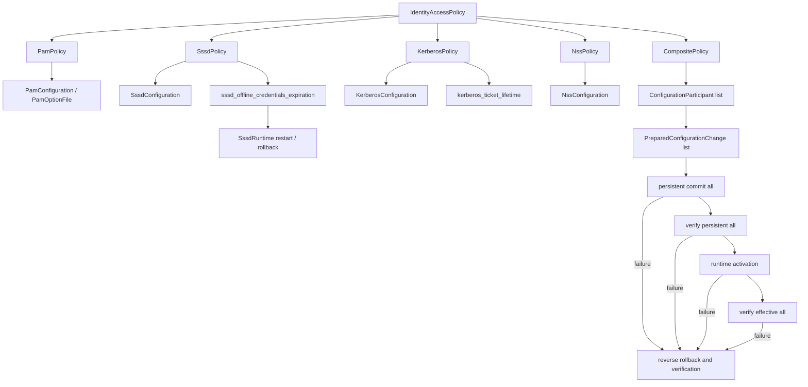

`Policy` объявляет immutable dependencies как полные `PolicyRef` со strength
`Required` или `Recommended` и declarative condition. Без указанного условия
действует `Always`; `OwnerValueEquals` сравнивает текущее значение policy,
объявившей dependency, с literal. Отсутствующее или несовпадающее
значение делает ребро неактивным: target не выполняется, не попадает в
result и не создаёт diagnostic. Disabled owner останавливается до вычисления
условий.

После регистрации всего candidate registry dependency graph проверяется на
missing/self/duplicate edges и cycles по всем объявленным рёбрам независимо
от их runtime-условий. Один owner может объявить только одно ребро к
каждому target, даже если сила или условие различаются. Literal в
`OwnerValueEquals` валидируется типом значения owner policy. Любая ошибка
сохраняет предыдущий registry и не допускает mutations.

Planner раскрывает граф только для enabled узлов, выполняет shared
dependency один раз и не возвращает hard-excluded module через активное
dependency edge. Все автоматически обработанные dependencies входят в
`PolicyApplySummary`, но успех request определяется только результатами
исходных requested roots. Failed/Disabled Required dependency блокирует dependent
с `Failed`; Recommended создаёт warning diagnostic, но не определяет результат
собственного `Policy.apply()`.

Вложенные `Policy` в composite не используются: только внешний объект в
`PolicyRegistry` сначала явно регистрирует каждый модуль вместе с его
`PolicyModule::view`, а затем добавляет policies только в известные модули.
`ModuleView` не выводится из имени модуля; конфликт metadata и ссылка policy на
неизвестный module являются ошибками регистрации. Dependency metadata
замораживается при добавлении policy, а полный DAG валидируется до замены
registry. Пустой модуль допустим.
Через вложенные `PolicyModule::submodules` registry владеет объектами
`Policy`, их `moduleConf`, `policyName` и значением. Composite владеет
подсистемными `ConfigurationParticipant`, и все они готовят изменения до
первой записи. Координатор является компенсирующей транзакцией, но не заявляет
crash-atomicity нескольких файлов без transaction journal.

## 6. Карта модулей и политик

```mermaid
flowchart TB
    init[initPolicyRegistry] --> arr["vector&lt;unique_ptr&lt;Policy&gt;&gt;"]

    arr --> dac[DAC]
    dac --> dacMode[ModeAndOwner]
    dacMode --> dacSystemCommandLock[systemcommandlock]
    dacMode --> dacBlockSystemFiles[blocking_user_access_to_system_files]
    dacMode --> dacCustomMode[custom_mode_and_owner]
    dac --> sudo[Sudo]
    sudo --> sudoEnvReset[sudo_env_reset]
    sudo --> sudoPassTries[sudo_passwd_tries]
    sudo --> sudoSecurePath[sudo_securepath]
    sudo --> sudoTimeout[sudo_timeout]
    sudo --> sudoRequireAuthentication[sudo_require_authentication]

    arr --> sysctl[SYSCTL]
    sysctl --> fsKernel[FSKernelProtection]
    sysctl --> globalKernel[GlobalKernelProtection]
    sysctl --> networkKernel[NetworkKernelProtection]
    globalKernel --> sysrqDisable[kernel_sysrq_disable]

    arr --> oss[OSS]
    oss --> display[DisplayManager]
    oss --> desktop[DesktopEnvironment]
    oss --> fstab[Fstab]
    oss --> grub[Grub]
    grub --> grubTimeout[grub_timeout]
    grub --> grubCmdline[grub_cmdline_linux]
    grub --> grubRecovery[grub_disable_recovery]

    arr --> net[NET]
    net --> ssh[Ssh]
    ssh --> sshPort[ssh_port]
    ssh --> sshMaxAuthTries[ssh_max_auth_tries]
    ssh --> sshRootLogin[ssh_root_login]
    ssh --> sshPubkeyAuth[ssh_pubkey_auth]

    arr --> firewall[FIREWALL]
    firewall --> blockRdp[block_rdp]
    firewall --> blockFtp[block_ftp]
    firewall --> customRules[custom_rules]
    firewall --> exclusiveControl[exclusive_firewall_control]

    arr --> identity[IDENTITY_ACCESS]
    identity --> pam[PAM]
    identity --> sssd[SSSD editor base]
    identity --> kerberos[KERBEROS editor base]
    identity --> nss[NSS editor base]
    identity -. abstract .-> composite[COMPOSITE]
    pam --> passwordMinLength[password_min_length]
    pam --> passwordMinClasses[password_min_classes]
    pam --> passwordHistoryDepth[password_history_depth]
    pam --> passwordHistoryRoot[password_history_enforce_for_root]
    pam --> failedAttempts[failed_authentication_attempts]
    pam --> countingPeriod[failed_authentication_counting_period]
    pam --> failedRoot[failed_authentication_enforce_for_root]
    pam --> unlockTime[failed_authentication_unlock_time]
    pam --> requiredPam[required_pam_enforcement]
    sssd --> offlineExpiration[sssd_offline_credentials_expiration]
    kerberos --> ticketLifetimePolicy[kerberos_ticket_lifetime]

    arr --> global[GLOBAL]
    global --> systemSettings[SystemSettings]
    systemSettings --> lang[lang]

    arr --> audit[AUDIT view=audit]
    audit --> auditLogging[logging]
    auditLogging --> logLevel[log_level]

    arr --> dc[DC view=device]
    dc --> dcRules[DeviceControl]

    dacSystemCommandLock --> map["PolicyRegistry<br/>module -> view + submodule -> policy -> object"]
    dacBlockSystemFiles --> map
    dacCustomMode --> map
    sudoEnvReset --> map
    sudoPassTries --> map
    sudoSecurePath --> map
    sudoTimeout --> map
    sudoRequireAuthentication --> map
    fsKernel --> map
    globalKernel --> map
    networkKernel --> map
    display --> map
    desktop --> map
    fstab --> fstabTmp[fstab_tmp_profile]
    fstab --> fstabVarTmp[fstab_var_tmp_profile]
    fstab --> fstabDevShm[fstab_dev_shm_profile]
    fstab --> fstabHome[fstab_home_profile]
    fstab --> fstabMedia[fstab_removable_media_profile]
    fstab --> fstabVarLog[fstab_var_log_secure_options]
    fstab --> fstabAudit[fstab_var_log_audit_secure_options]
    fstab --> fstabBoot[fstab_boot_profile]
    fstab --> fstabBootEfi[fstab_boot_efi_profile]
    fstab --> fstabSrv[fstab_srv_profile]
    fstab --> fstabOpt[fstab_opt_profile]
    fstabTmp --> map
    fstabVarTmp --> map
    fstabDevShm --> map
    fstabHome --> map
    fstabMedia --> map
    fstabVarLog --> map
    fstabAudit --> map
    fstabBoot --> map
    fstabBootEfi --> map
    fstabSrv --> map
    fstabOpt --> map
    sshPort --> map
    sshMaxAuthTries --> map
    sshRootLogin --> map
    sshPubkeyAuth --> map
    passwordMinLength --> map
    passwordMinClasses --> map
    passwordHistoryDepth --> map
    failedAttempts --> map
    unlockTime --> map
    lang --> map
    logLevel --> map
    dcRules --> map
```

`ModeAndOwner` выполняет `fstat`, `fchown`, `fchmod` и контрольный `fstat` через
один descriptor. После успешного `fchown` состояние перечитывается до решения о
необходимости `fchmod`, поскольку Linux может сбросить SUID/SGID при смене
владельца. Проверка режима учитывает маску `07777`, включая SUID, SGID и sticky
bit.

Обычный конечный объект открывается с `O_NOFOLLOW`. Platform profile может
задать для конкретного `FileAccessRule` точный список допустимых целей symlink в
самом policy path. Пустой список запрещает такой symlink; пользовательский
`custom_mode_and_owner` всегда использует пустой список. Относительная цель
разрешается от каталога policy path и лексически нормализуется. Сам symlink
закрепляется `O_PATH|O_NOFOLLOW`-дескриптором и читается через
`readlinkat(descriptor, "")`. Разрешённая абсолютная цель открывается от
дескриптора `/` через `openat2` с `RESOLVE_IN_ROOT`, `RESOLVE_NO_SYMLINKS` и
`RESOLVE_NO_MAGICLINKS`: промежуточные symlink в target namespace запрещены, а
все изменения относятся к одному открытому target inode. На ядре без
`openat2` profile-исключение отклоняется (fail closed), обычные пути продолжают
работать.

До возврата target descriptor имя policy symlink повторно сверяется по
`st_dev/st_ino`. Привилегированный конкурент всё ещё может переименовать его
после этой проверки; это может сделать namespace несоответствующим уже
применённому правилу, но не перенаправляет `fchown`/`fchmod` на иной inode:
операции остаются привязаны к предварительно проверенной allowlisted цели.
Отсутствующие файлы из platform profile пропускаются, поскольку соответствующий
пакет может быть не установлен; отсутствующий явно заданный
`custom_mode_and_owner` path является ошибкой. Неожиданная цель symlink и ошибки
открытия не считаются отсутствующим файлом.

В профилях Debian 12/13 и Ubuntu 24.04/26.04 для `/etc/resolv.conf` разрешены
три динамические цели `systemd-resolved`:
`/run/systemd/resolve/stub-resolv.conf`,
`/run/systemd/resolve/resolv.conf` и
`/usr/lib/systemd/resolv.conf`. Профиль ALT p11 не объявляет это исключение:
штатная для него конфигурация в проекте не предполагает управление данным
путём через эти цели. Вместо этого ALT p11 объявляет две собственные
package-owned связи: `/etc/sysctl.conf` → `/etc/sysctl.d/99-sysctl.conf` и
`/etc/grub.cfg` → `/boot/grub/grub.cfg`. Разрешены только эти точные конечные
цели; GRUB-политики редактируют канонический regular file
`/etc/sysconfig/grub2`, а не symlink `/etc/default/grub`.

Для защищаемых системных команд исключений также нет;
пути merged-`/usr` с symlink-каталогами продолжают работать как обычные пути,
но symlink в последнем компоненте запрещён.

`ExclusivePidLock` открывает lock-файл с `O_CLOEXEC|O_NOFOLLOW`, а `FileStats`
получает close-on-exec duplicate этого descriptor. Поэтому коррекция метаданных,
`flock`, чтение/запись PID, `ftruncate` и `fsync` относятся к одному inode;
дубликат не забирает владение descriptor у lock-класса.

## 7. Работа GUI

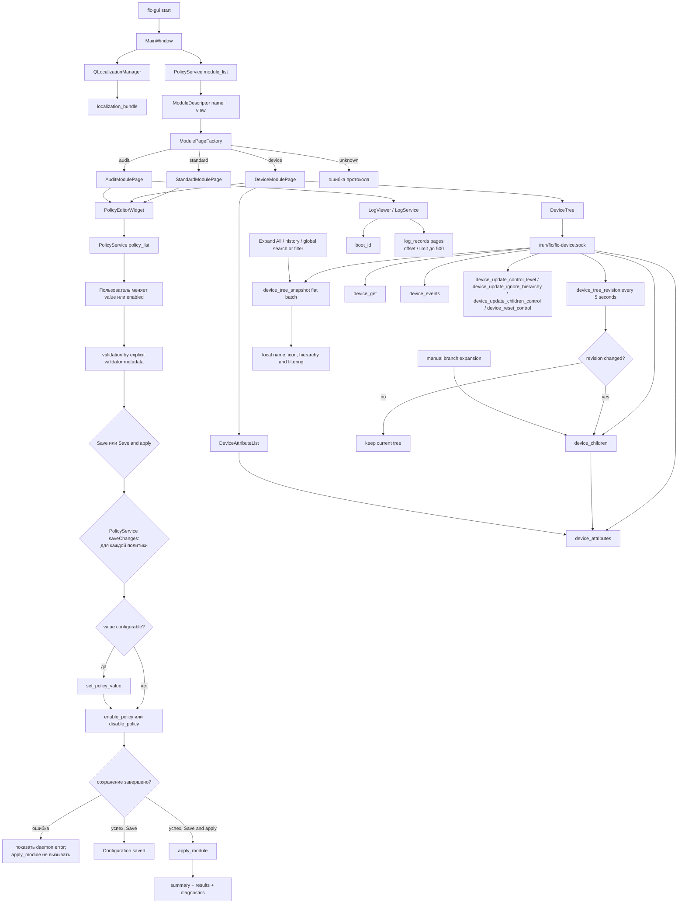

GUI не применяет политики к ОС напрямую. Он показывает данные, валидирует ввод на стороне интерфейса и затем отправляет изменения демону отдельными IPC-командами.
`ModuleView` хранится только в дескрипторе модуля и выбирает Qt-страницу; на
порядок или семантику применения политик он не влияет. `policy_list` не
дублирует `view`, но содержит метаданные, достаточные для стандартного
редактора. Будущий `fic-web` должен использовать тот же JSON API, не Qt-код и
не прямое чтение конфигов, device DB или лог-файлов.
Логи загружаются страницами не более 500 записей и 768 КиБ; GUI следует по
`next_offset`, пока `has_more` остается истинным. IPC-команды `boot_id` и
`log_records` не пишут audit-записи, потому что LogViewer использует их как
polling/read path; запись в тот же audit-журнал во время чтения сдвигает
offset-пагинацию и приводит к повторному отображению уже прочитанных строк.

## 8. Сбор и отображение устройств

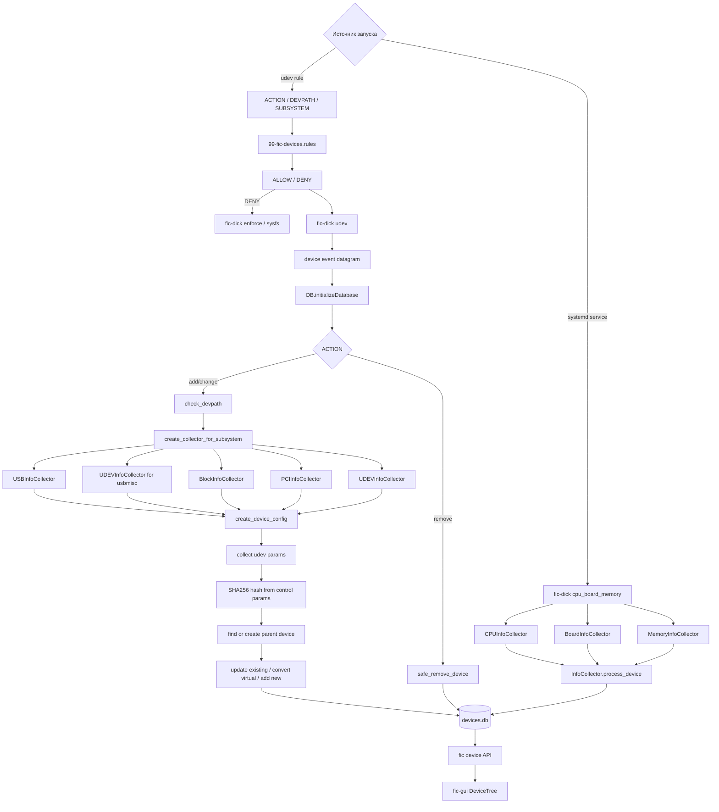

## 9. Хранилища данных

Production-значения путей задаются один раз в
`cmake/FicInstallLayout.cmake`. На этапе конфигурации CMake из них создаются
типизированные C++ defaults для `fic-core`/`fic-ipc`, а также systemd,
tmpfiles, udev и XDG-шаблоны. Исполняемые компоненты инициализируют неизменяемый
контекст путей при старте; общий слой базы устройств получает `DBOptions`
явно и поэтому не знает о layout продукта.

Это не единый `FIC_ROOT`: config, logs, static data и runtime socket
остаются независимыми семантическими путями. Такой контракт позволяет менять
профиль установки через CMake без строковых замен в C++ или service-файлах.
Deb/RPM staging устанавливает именованные CMake-компоненты (`fic`, `fic-dick`,
`fic-cli`, `fic-session-agent`, `fic-gui`) и не копирует эти файлы повторно из
дерева исходников.

Версии product, IPC, конфигураций и SQLite независимы; точные значения
генерируются `fic-common/fic-version`. Schema 1 является первой поддерживаемой
схемой конфигурации и device DB. Package lifecycle останавливает сервисы,
создаёт только отсутствующие конфиги и отсутствующую/пустую БД непосредственно
в schema 1, строго проверяет оба состояния и только затем синхронизирует trust и
запускает сервисы. Существующее несовместимое состояние не изменяется. Полный
контракт описан в `docs/upgrade-contract.md`.


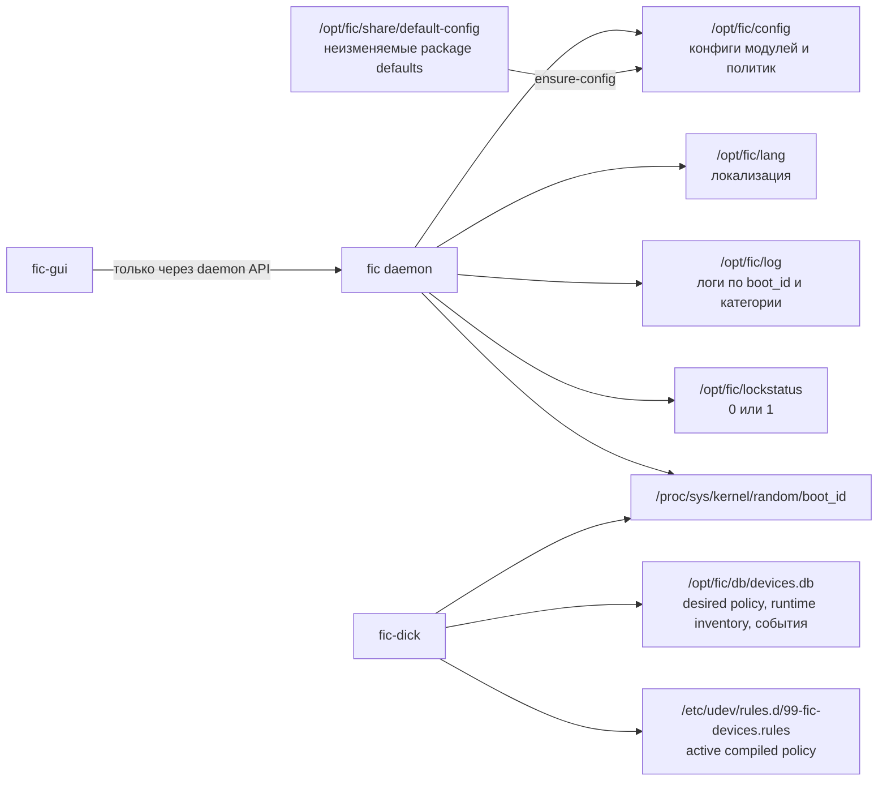

Production IPC использует профиль `ProductionAdmin`: реальный (не symlink)
runtime-каталог `root:root 0755` и сокет `root:fic 0660`. Группа `fic` может
подключаться к сокету, но не может удалить или подменить его имя в runtime-
каталоге. Явный `--socket` включает
профиль разработки с сокетом `0600`; этот режим не ослабляет production path.
Установленное дерево `/opt/fic` отделено от этой модели: оно принадлежит
`root:fic`, но группа имеет только read/traverse/execute (`2750` для каталогов,
`0640` для обычных файлов и `0750` для `/opt/fic/bin`). Член группы может
читать конфигурацию и БД для диагностики, но клиентские изменения по-прежнему
выполняются только через daemon API.
