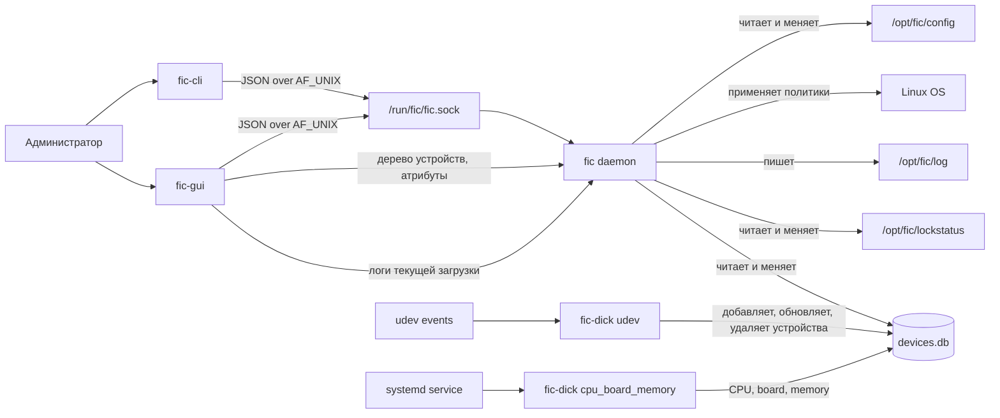
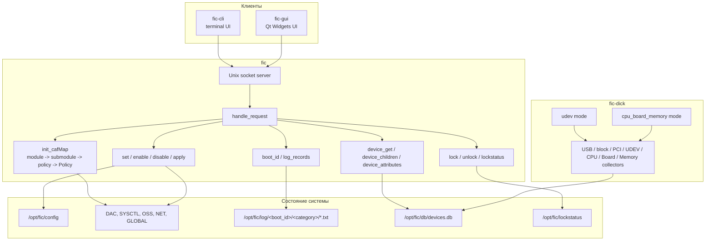
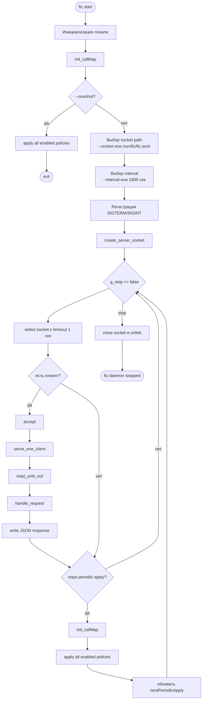
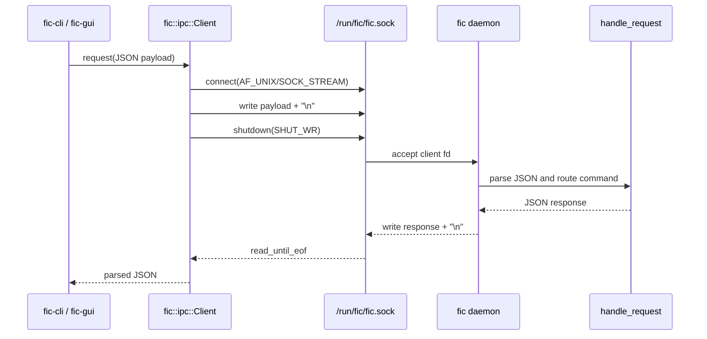
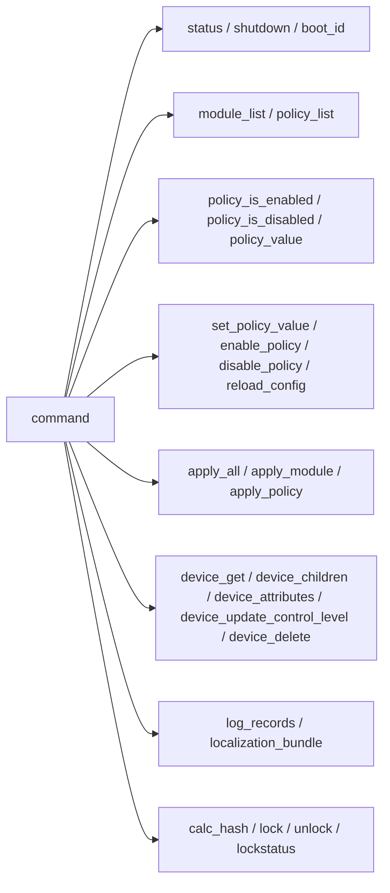
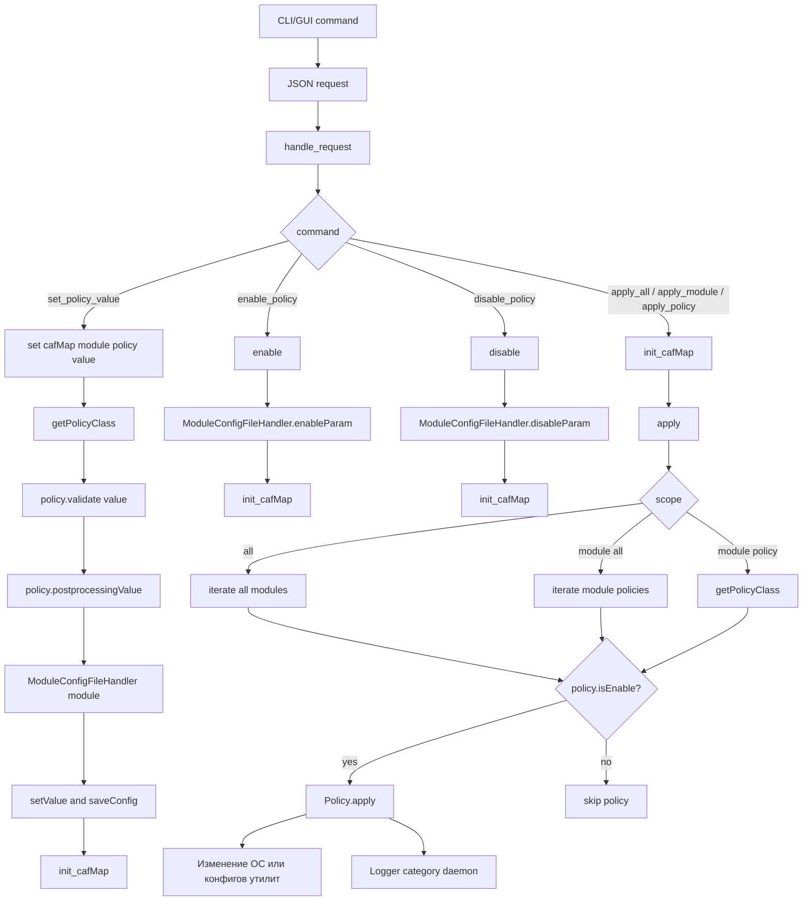
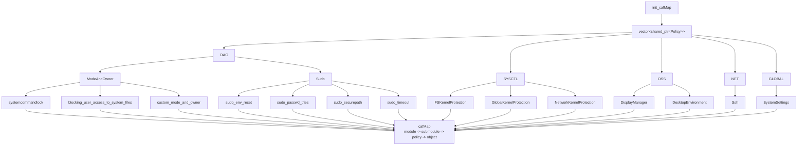
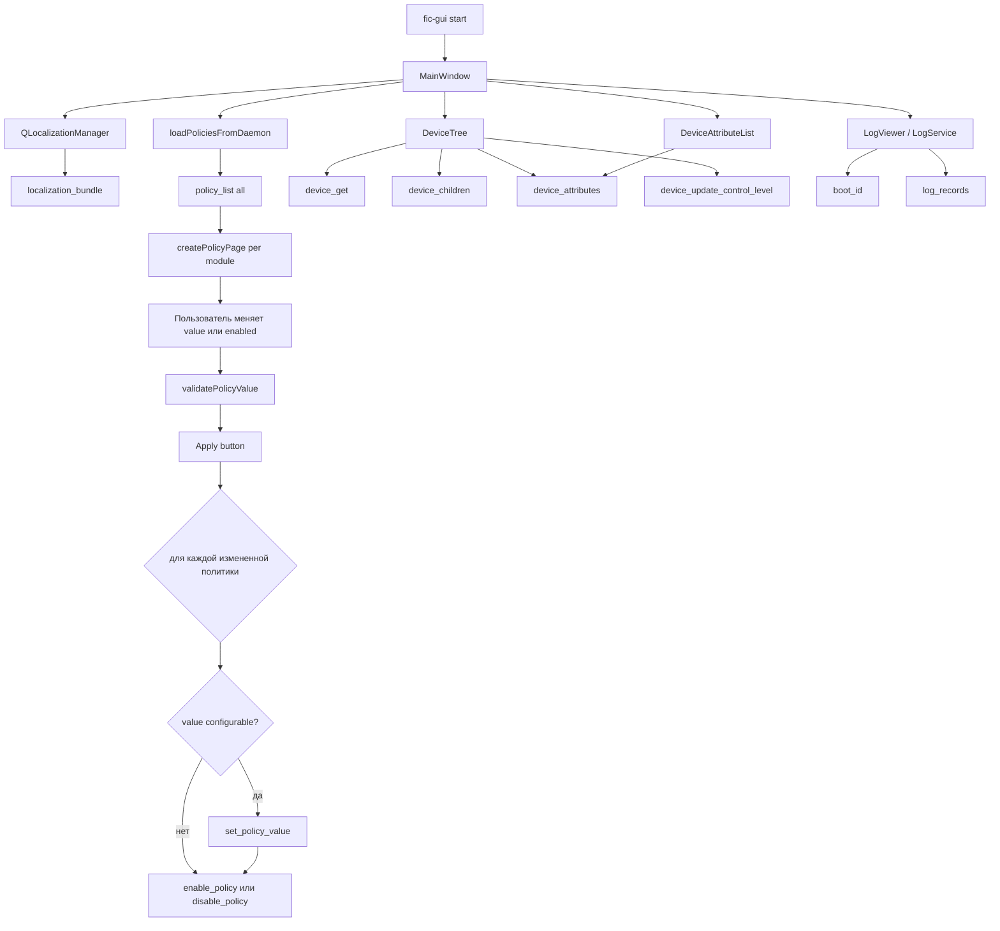
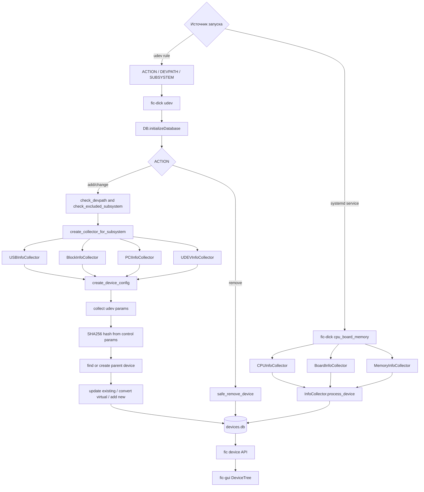
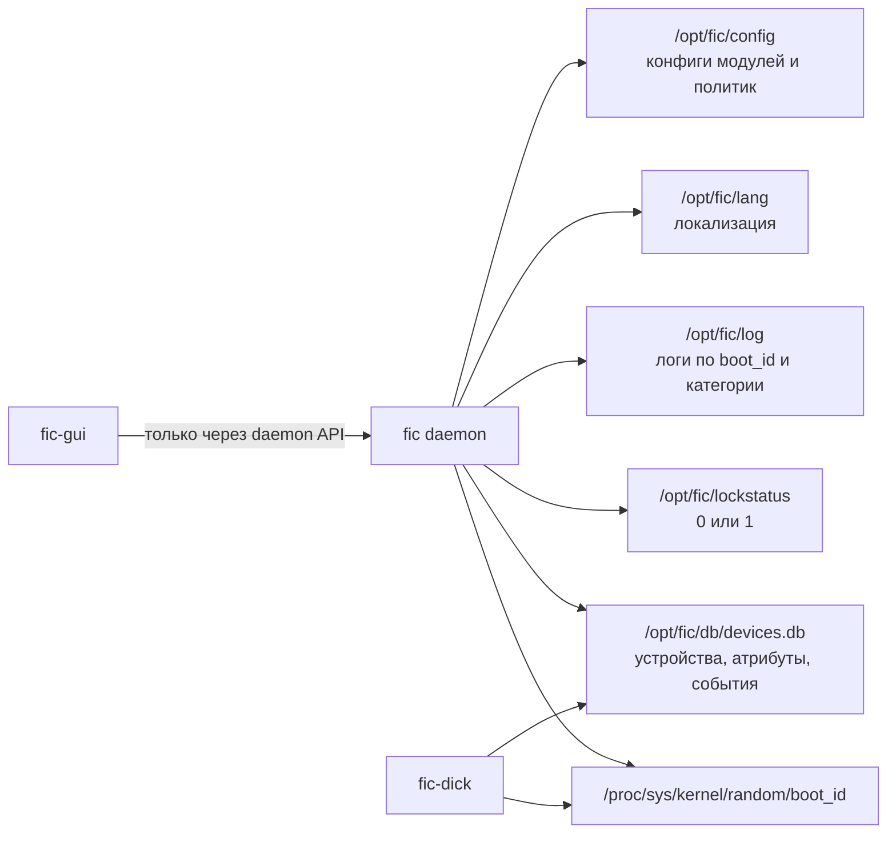

# FIC 2.0: диаграммы работы проекта

Документ описывает текущую архитектуру по коду `fic`, `fic-cli`, `fic-gui` и `fic-dick`.
Диаграммы написаны в Mermaid и должны отображаться в GitHub, GitLab, Obsidian и многих IDE.

## 1. Общая архитектура

Главная идея проекта: только демон `fic` владеет изменением конфигурации политик и применением настроек к ОС. `fic-cli` и `fic-gui` являются клиентами daemon API. `fic-dick` отдельно поддерживает базу устройств, а демон отдает эти данные GUI через тот же IPC-слой.

Общая IPC-логика вынесена в библиотеку `fic-common/fic-ipc`; она содержит клиентский
код Unix socket/JSON-протокола и общие helpers ответа. Клиенты и демон
используют ее как публичную границу IPC вместо прямого include из `fic/src`.

Работа с SQLite-базой устройств вынесена в библиотеку `fic-common/fic-device-db`.
Демон `fic` и сборщик `fic-dick` используют общий слой доступа к `devices.db`,
а не собирают реализацию БД вручную из исходников другого компонента.

Доступ к daemon API намеренно задается правами Unix-сокета. Члены системной
группы `fic` считаются полными администраторами FIC и на текущем этапе имеют
полный доступ ко всем командам API демона. Это осознанное решение: обычных
пользователей не следует добавлять в группу `fic`.

## 2. Компоненты и зоны ответственности

## 3. Жизненный цикл демона `fic`

## 4. IPC-запрос от CLI или GUI

Основные команды IPC:

## 5. Изменение и применение политики

## 6. Карта модулей и политик

## 7. Работа GUI

GUI не применяет политики к ОС напрямую. Он показывает данные, валидирует ввод на стороне интерфейса и затем отправляет изменения демону отдельными IPC-командами.

## 8. Сбор и отображение устройств

## 9. Хранилища данных

